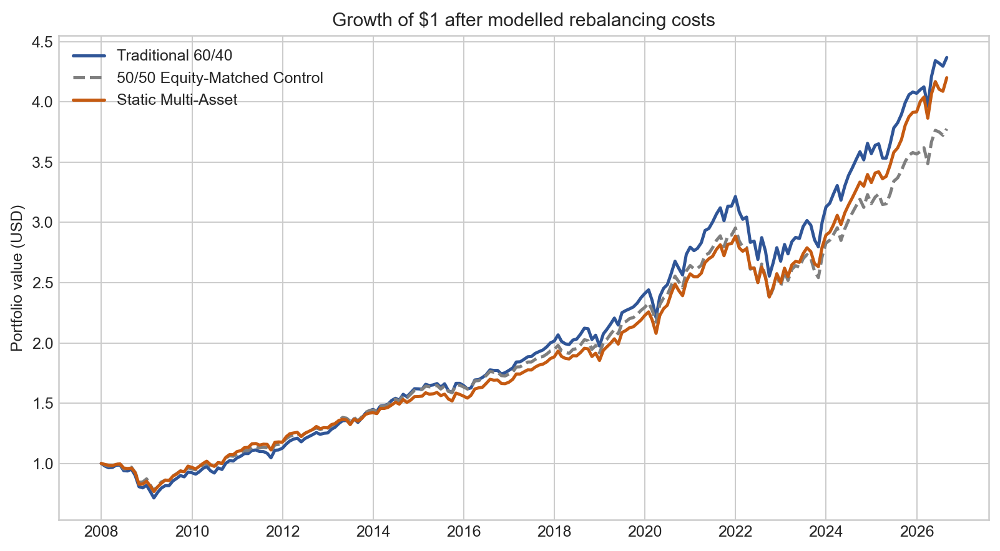
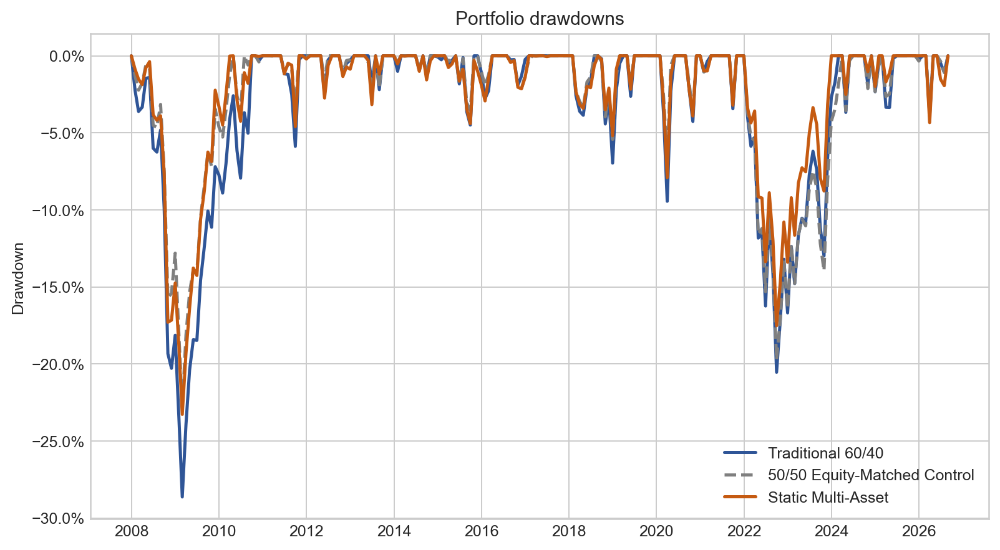
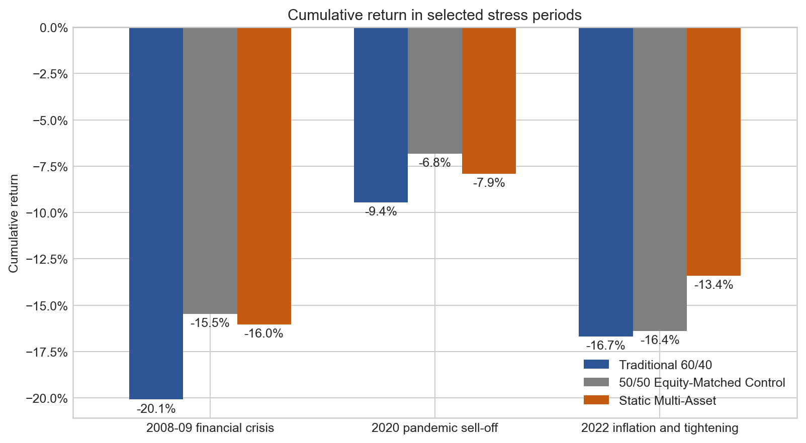
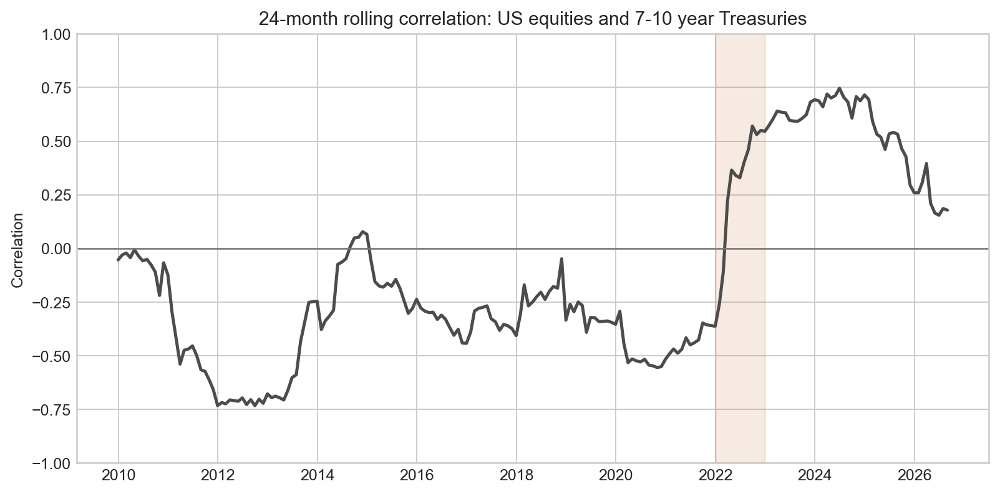

# When Diversification Fails

### A transparent test of whether gold and short-term Treasuries can reduce downside risk when stocks and intermediate-term government bonds fall together

> Can a simple static multi-asset allocation improve downside outcomes relative to a traditional 60/40 portfolio without market timing or backtest-optimised weights?

## Motivation

During my internship in the Investment Banking Department of Shanghai Pudong Development Bank, I supported due diligence for corporate debt-financing programmes. That work introduced fixed income from the issuer's perspective: why companies raise debt, how repayment capacity is assessed and which risks matter before issuance.

This project takes the complementary investor perspective. Once debt is issued, an investor must ask a different question: what role should government bonds play inside a portfolio when growth, inflation and interest-rate risks change?

A traditional 60/40 portfolio relies partly on government bonds offsetting equity losses. That relationship worked reasonably well during growth-led sell-offs such as 2008 and early 2020, but became less reliable in 2022, when inflation and rapid monetary tightening hurt both equities and duration-sensitive bonds. This study asks whether adding gold and short-term Treasuries can reduce reliance on that single stock-bond relationship.

No client, transaction or internal information from the internship is used. The analysis relies exclusively on public market data.

## Research question

Can a transparent, static allocation to gold and short-term Treasuries improve downside outcomes relative to a traditional 60/40 portfolio?

The objective is not to identify a historically optimal portfolio or predict macroeconomic regimes. It is to measure a practical trade-off: how much historical return, if any, was exchanged for lower volatility and a shallower maximum drawdown?

## Assets

| Asset | Proxy | Role in the analysis |
|---|---|---|
| US equities | IVV | Long-term growth exposure |
| 7-10 year US Treasuries | IEF | Duration exposure and traditional defensive asset |
| Gold | IAU | Asset with different economic drivers |
| Short-term US Treasuries | SHV | Low-duration defensive allocation |

The analysis uses official monthly NAV total returns from January 2008 to August 2026. Returns are measured in US dollars and include reinvested distributions. See [`data/README.md`](data/README.md) for source links and setup instructions.

## Portfolio design

| Portfolio | IVV | IEF | IAU | SHV |
|---|---:|---:|---:|---:|
| Traditional 60/40 | 60% | 40% | 0% | 0% |
| 50/50 Equity-Matched Control | 50% | 50% | 0% | 0% |
| Static Multi-Asset | 50% | 30% | 10% | 10% |

All portfolios are rebalanced monthly. The 50/50 portfolio is a diagnostic control with the same equity weight as the multi-asset portfolio. It helps distinguish the effect of holding less equity from the effect of replacing some intermediate Treasuries with gold and short-term Treasuries. The 50/30/10/10 weights are a simple, interpretable example. They were not selected by searching for the best historical performance.

A stylised transaction cost of **10 basis points per dollar traded** is deducted at each rebalance. Ten basis points equal 0.10% of traded value, so trading $100 incurs a modelled cost of $0.10. Purchases and sales are both counted, while initial portfolio formation is not charged. This is an implementation assumption rather than an estimate of any specific broker's fees.

## Analysis

The portfolios are evaluated using:

- annualised compound return;
- annualised volatility;
- maximum drawdown;
- cumulative wealth and drawdown paths;
- 24-month rolling correlation between IVV and IEF; and
- cumulative performance during the 2008-09 financial crisis, the 2020 pandemic sell-off and the 2022 inflation and tightening shock.

The rolling correlation is a diagnostic only. It is not a trading signal and does not change portfolio weights.

## Results

| January 2008-August 2026 | Traditional 60/40 | 50/50 Control | Static Multi-Asset |
|---|---:|---:|---:|
| Annualised return | 8.22% | 7.38% | 7.99% |
| Annualised volatility | 9.64% | 8.36% | 8.47% |
| Maximum drawdown | -28.63% | -22.81% | -23.28% |

Relative to 60/40, the multi-asset portfolio gave up approximately 0.23 percentage points of annualised return while reducing annualised volatility by approximately 1.17 percentage points and making maximum drawdown approximately 5.36 percentage points shallower.

The 50/50 control had slightly lower volatility and a slightly shallower full-period maximum drawdown than the multi-asset portfolio. The multi-asset portfolio, however, earned a higher annualised return and lost less in 2022. This is not evidence that one allocation dominates the others. It shows that lower equity exposure explained part of the risk reduction, while the additional diversifiers changed which shocks the portfolio handled better.





### Selected stress periods

| Cumulative month-end return | Traditional 60/40 | 50/50 Control | Static Multi-Asset |
|---|---:|---:|---:|
| Sep 2008-Mar 2009 | -20.08% | -15.47% | -16.03% |
| Feb-Mar 2020 | -9.44% | -6.82% | -7.90% |
| Calendar 2022 | -16.69% | -16.38% | -13.40% |



## Interpretation

The source of a shock matters. During a growth-led shock, weaker earnings expectations hurt equities while lower expected policy rates and demand for safe assets can support government bonds. During an inflation-led tightening cycle, higher discount rates can hurt both equities and intermediate-duration bonds.



Gold and short-term Treasuries do not provide guaranteed protection. Their purpose in this experiment is to reduce reliance on the assumption that intermediate Treasuries will always offset equity losses.

## Investor implications

The results are most relevant to investors who care about the path of returns, such as investors with withdrawal needs, limited tolerance for large losses or a high risk of selling during drawdowns. An investor with a long horizon and greater loss tolerance may prefer more growth exposure.

The appropriate allocation therefore depends on the investor's objectives and constraints, not simply on which backtest reports the smallest drawdown. For a long-horizon, drawdown-sensitive investor with limited capacity for tactical decisions, a transparent static allocation may be easier to govern than a macro-timing strategy.

## Limitations

- The common ETF sample begins in 2008 and contains only a limited number of inflation and interest-rate environments.
- The analysis uses US assets and US-dollar returns. A UK investor would also need to consider global diversification, sterling liabilities and currency hedging.
- The 50/50 control matches the multi-asset portfolio's equity weight, but it does not match total portfolio volatility, duration or every underlying risk exposure.
- The 50/30/10/10 allocation is illustrative rather than optimal.
- Rolling correlation and stress-period returns describe historical behaviour but do not prove that a particular macroeconomic variable caused it.
- Transaction costs are simplified. Taxes, investor-specific fees, market impact, foreign-exchange costs and time-varying bid-ask spreads are excluded.

## Conclusion

The analysis does not argue that the 60/40 portfolio is obsolete. It shows that its defensive properties depend on the nature of the shock.

A static allocation to assets with different duration and economic exposures historically reduced drawdown severity without requiring regime forecasts. Whether that improvement justifies a modest reduction in return is an investor-specific decision.

## Repository structure

```text
when-diversification-fails/
├── README.md
├── analysis.ipynb
├── requirements.txt
├── data/
│   └── README.md
├── src/
│   └── data_loader.py
├── outputs/
│   ├── portfolio_summary.csv
│   └── stress_periods.csv
└── figures/
    ├── cumulative_returns.png
    ├── drawdowns.png
    ├── rolling_correlation.png
    └── stress_periods.png
```

## Reproduce the analysis

1. Download and rename the four official iShares workbooks as described in [`data/README.md`](data/README.md).
2. Place them in `data/raw/`.
3. Create a Python environment and install `requirements.txt`.
4. Open `analysis.ipynb` and run all cells.

The notebook writes the two summary tables to `outputs/` and the four charts to `figures/`.

## Disclaimer

This project is for educational and portfolio-demonstration purposes only. It does not constitute investment advice, and past performance does not predict future results.
